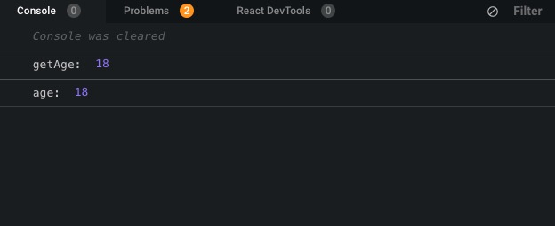
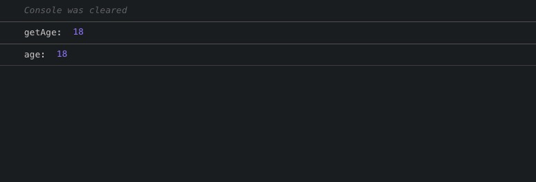
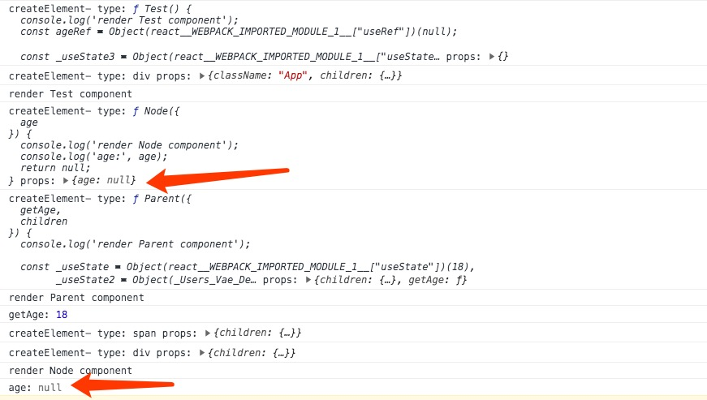
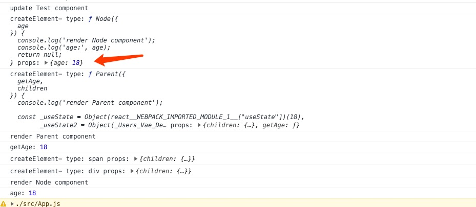

# A Callback Thinking

首先为什么会想到写这篇文章，写这篇文章的由来主要是内部的一个项目导致的，这个引起了我的一些思考。那到底是什么呢？

## 目录

- 为什么会出现这种场景
- 如何解决这个场景
- react 内部是如何运作的才会导致这种场景的出现

## 为什么会出现这种场景

在使用 `React` 的时候，父子间是如何通信的，我相信基本上所有人都是知道的，父传递数据给子是通过 `props` 的形式

```js{2}
function A() {
  return <B name="lanyincao" age="18" />
}
```

此时 B 组件接受 `name` 和 `age` 这两个 props, 在 B 组件内部就可以拿到这两个数据进行相应的处理操作。那么子如何把数据传递给父呢？我们知道应该回调的方式

```js{7-9}
function A() {
  const handleChange = value => {}
  return <B onChange={handleChange} />
}

function B({ onChange }) {
  if (onChange) {
    onChange('XXXX')
  }
  return null
}
```

在 B 组件内部调用 A 组件传递下来的 `onChange` 回调，通过 `onChange` 再把 B 中的数据反传回去。基本上父子通信就可以很快的完成了。至于其他的方法我在这里不做过多的描述，主要是为了引出
另一个问题。

此时有这样的一个组件的结构。

```js{5-8}
function Parent({ getAge, children }) {
  console.log('render Parent component')
  const [age] = useState(18)

  if (getAge) {
    console.log('getAge:', age)
    getAge(age)
  }

  return (
    <div>
      <span>{children}</span>
    </div>
  )
}

function Node({ age }) {
  console.log('render Node component')
  console.log('age:', age)
  return null
}

export function Test() {
  console.log('render Test component')
  const ageRef = useRef(null)
  const [state, forceUpdate] = useState(false)

  if (state === true) {
    console.log('update Test component')
  }

  return (
    <Parent getAge={age => (ageRef.current = age)}>
      <Node age={ageRef.current} />
    </Parent>
  )
}

ReactDom.render(<Test />, document.getElementById('root'))
```

`Test` 组件有一个 `children` 组件叫做 `Parent`, 在 `Parent` 组件内部调用了 `getAge` 方法, `getAge` 方法就是一个回调, 通过 `getAge` 方法把
age 返回出去给父组件使用。那么不妨在仔细看下 `Test` 组件，在调用 `getAge` 方法的时候把 age 挂到 ref 上，我们知道在函数中 ref 可以当做和 class 中的 this
一样去使用，所以在 render Parent 的时候， ageRef.current 就会被赋予新的值, 那么 ageRef.current 被赋予新的值后，是否此时 `Node` 组件获取到的 age 就是新的值呢？
不妨看一下输出


可以看出在 `Node` 组件中, 此时 age 是 null, 对啊为什么会是 null 呢，不应该啊，如果是 18 应该多好啊。有可能在 `Node` 组件内部，会使用数字的一些方法，那么如果是 null,
这样就会导致页面白屏了，就会造成严重的问题。

## 如何解决这个场景

上面出现的 age is null, 这样的情况，应该如何去解决呢？ 首先我们知道 ageRef 是一个拥有 current 属性的一个对象，那么此时不妨把 ageRef 传递到子组件中，在子组件中使用
`ageRef.current` 来获取到新的 age 的值，好了不妨试一下！！！

- 传递引用到子组件中

```js{13,22}
function Parent({ getAge, children }) {
  const [age] = useState(18)

  if (getAge) {
    console.log('getAge:', age)
    getAge(age)
  }

  return <div>{children}</div>
}

function ResovedNode({ age }) {
  console.log('age:', age.current)
  return null
}

export function ResovedTest() {
  const ageRef = useRef(null)

  return (
    <Parent getAge={age => (ageRef.current = age)}>
      <ResovedNode age={ageRef} />
    </Parent>
  )
}
```

现在传递到 Node 组件中的 age 是 `ageRef.current`, 在看看输出



此时在 `Node` 组件中获取到的 ageRef.current 就是正确的值了，为什么，因为在 Parent 中的 ageRef 和传递下去的是同一个引用，所以在 render parent 的时候，
调用了 getAge 此时 ageRef.current 被修改了。那么当渲染到 Node 的时候，获取到的 `ageRef` 就可以拿到在 Parent 组件中的 age 的值了。

[try it in codesandbox](https://codesandbox.io/s/yici-huidiaodefenxi-y20cf)

- 传递函数到子组件中

函数是具有懒执行也就是延迟执行的作用，我们可以在任何时候控制函数的执行。所以如何传递一个函数到子组件中是否也可以达到一样的效果呢？

```js{13,22}
function Parent({ getAge, children }) {
  const [age] = useState(18)

  if (getAge) {
    console.log('getAge:', age)
    getAge(age)
  }

  return <div>{children}</div>
}

function ResovedNode2({ age }) {
  console.log('age:', age())
  return null
}

export function ResovedTest2() {
  const ageRef = useRef(null)

  return (
    <Parent getAge={age => (ageRef.current = age)}>
      <ResovedNode2 age={() => ageRef.current} />
    </Parent>
  )
}
```

此时传递给 Node 的 age 是一个函数 `() => ageRef.current`, 这个函数返回了 `ageRef.current`, 因为现在传递给 Node 的是一个函数，而这个函数的执行时机是在 Node 组件的
render 时机，所以在 Node 中总是可以拿到新的值。不妨看一下数据



可以看出此时输出的 age 都是正确的。

[try it in codesandbox](https://codesandbox.io/s/yici-huidiaodefenxi-y20cf)

## react 内部是如何运作的才会导致这种场景的出现

在上面的场景中已经知道有两种解决办法，那么不妨考虑一下为什么第一种是不行的呢？那么不妨对 react 进行调试一下就能知道为什么了

首先在 react 的源码的 createElement 的内部打印一下

```js
function createElement(type, config, children) {
  var propName; // Reserved names are extracted

  ...some

  console.log('createElement-', `type:`, type, 'props:', props)

  return ReactElement(type, key, ref, self, source, ReactCurrentOwner.current, props);
}
```

为什么要在 `createElement` 里面打印呢，我们知道 React 会调用 `React.createElement` 返回 ReactElment 对象，调用的是在 `babel` 插件中做的，具体
可以去看一下插件。可以主动调用 `React.createElement`, 也可以写成 `JSX` 的形式， React 会自行解析。那不妨看一下此时的输出



从输入可以看出在调用 `createElement` 的时候, 此时 Node 的 props 已经确定了， 此时的 age 是 null, 所以当 render Node 组件的时候，此时的 age 就是 null,
这就是为什么拿不到最新的值的原因了，因为 `createElement` 的时候已经确定了这个 props 的值。如果后续发生 `update`, 会继续调用 `createElement`, 此时 Test 组件中的
`ageRef.current` 已经更新成最新的值了。不妨看一下输出



可以看出此时的 `ageRef.current` 已经是最新的啦

## conclusion

通过这次场景，分析了一下为什么在 `React` 中第一次 age 是 null 的原因，也知道了如何来解决这个 null 的问题。

又是一个愉快的周末呀 😄😌
