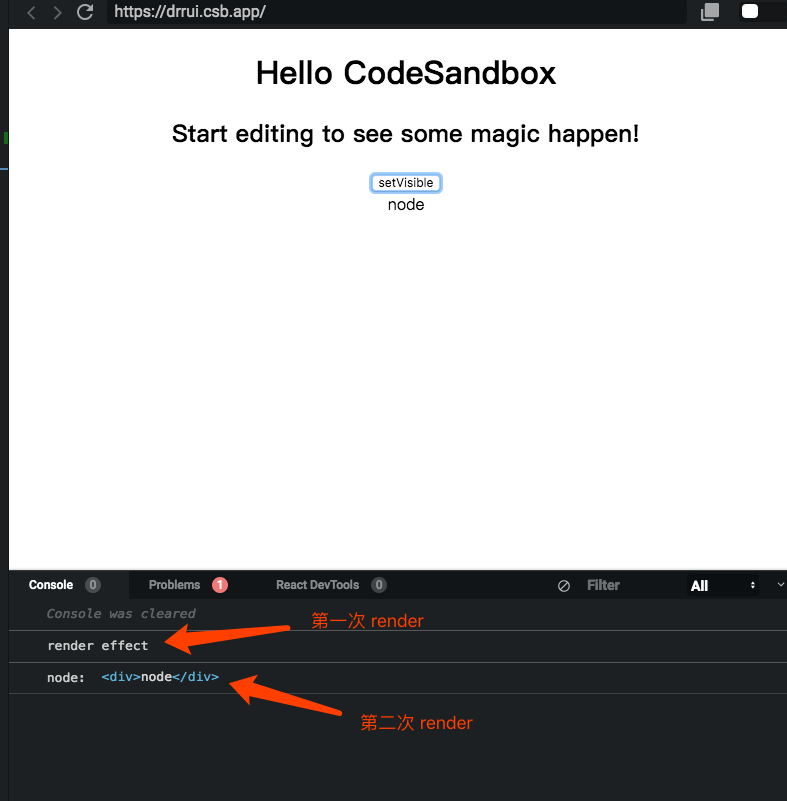
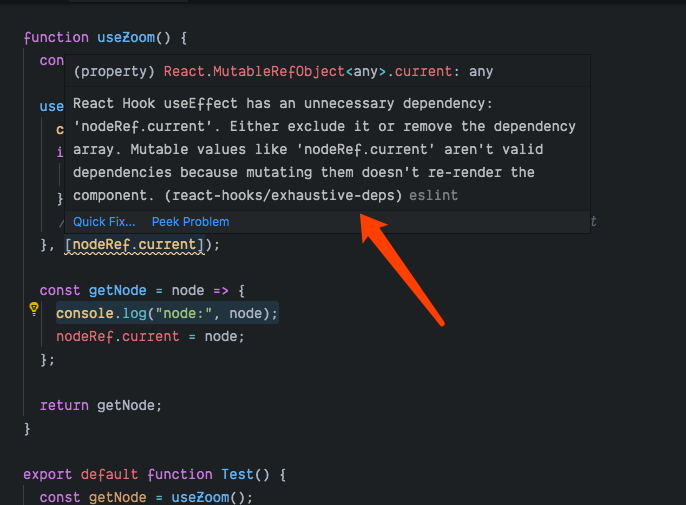
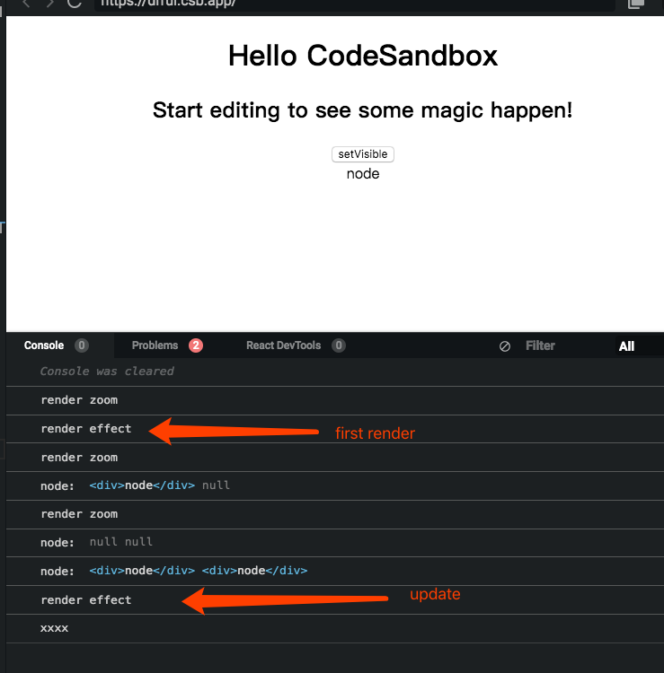
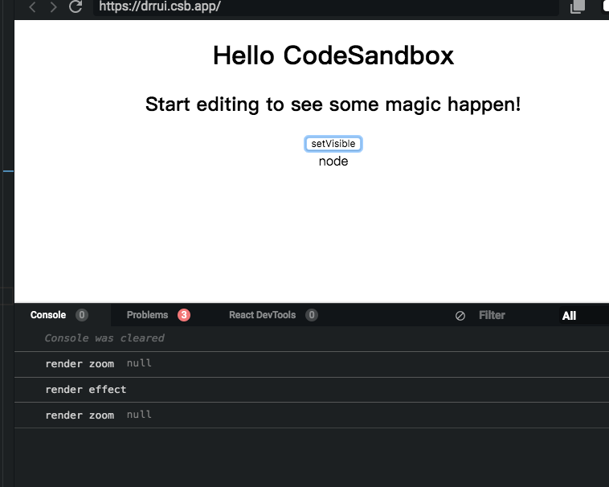
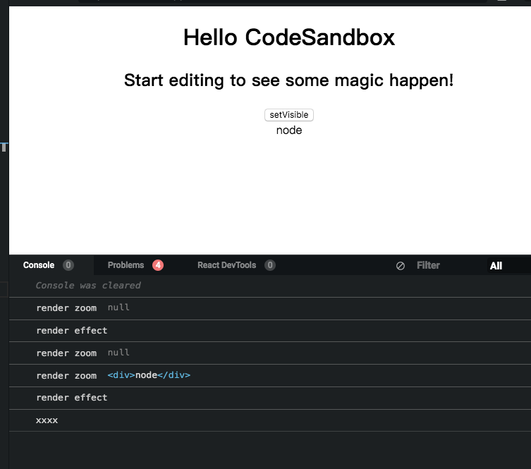

# A Thought Of Hook

这几天一直忙于各种事情，仔细思考一件事的时间真的不是很多，但是由于今天值班所以时间还是偏多的，在看完了想看的文章或者博客后，开始了继续写手势这一块的 `Hook`,
恰好遇到了一个问题，这个问题经过了我们内部讨论出有两种解决办法，两种办法都是没有问题的，各有优缺点。那么今天遇到的问题到底是什么呢？

## 目录

- 遇到的问题？
- 如何解决
- 是否这样的解决是好的, 如何选择

## 遇到的问题

之前我们的所有库都是开启了 [react-hook-eslint-plugin](https://reactjs.org/docs/hooks-rules.html#eslint-plugin), 重点是这个规则

```js
"react-hooks/exhaustive-deps": "warn"
```

正好我这次的库我忘记去开启了就遇到了这个问题，简化一下例子

```js
function useZoom() {
  const nodeRef = useRef(null)

  useEffect(() => {
    if (nodeRef.current) {
      console.log('xxxx')
    }
    // 使用 nodeRef.current 作为依赖是为了当有节点的是可以重新执行 effect
  }, [nodeRef.current])

  const getNode = node => {
    nodeRef.current = node
  }

  return getNode
}
```

这是一个基础的自定义 hook, 这个 Hook 暴露出了一个函数叫做 `getNode`, 使用这个 `getNode` 挂载到任何一个 `dom` 节点上，当 `node` 存在的时候执行一些逻辑操作, 那么此时使用这个 hook

```js
function Test() {
  const getNode = useZoom()
  const [visible, setVisible] = useState(false)

  return (
    <div>
      <button onClick={() => setVisible(true)}>setVisible</button>
      {visible && <div ref={getNode}>node</div>}
    </div>
  )
}
```

仔细看这个 `Test`，因为在顶层调用了 `useZoom`, 此时内部拿到的 `nodeRef.current = null`, 所以 `console` 不会走这是合理的，那么此时在点击 `setVisible`, 此时改变了
`visible`, node 节点将会显示出来，此时 getNode 将会拿到正确的信息，但是你会发现一个奇怪的现象就是为什么内部的 `console` 仍然没有打印出来？？？这该不会是 react 的 bug 吧
那么不妨在 `useEffect` 中答应一下信息看看，修改下代码

```js
function useZoom() {
  const nodeRef = useRef(null)

  useEffect(() => {
    console.log('render effect')
    if (nodeRef.current) {
      console.log('xxxx')
    }
    // 使用 nodeRef.current 作为依赖是为了当有节点的是可以重新执行 effect
  }, [nodeRef.current])

  const getNode = node => {
    console.log('node:', node)
    nodeRef.current = node
  }

  return getNode
}
```

第一次加载的时候，应该只会显示 `render effect`， 此时我们点击 `setVisible`, 看一下输出



[try it](https://codesandbox.io/s/stoic-firefly-drrui)

可以看出 `render effect` 只输出了一次对不对，是不是很奇怪，明明 `nodeRef.current` 已经修改了，可是为啥这里的 `effect` 没有重新执行呢？于是我就喊了我们组的
`煜寒` 过来(此时时间比较早只有煜寒来公司了)开启`小黄鸭`调试法，结果还是没看出什么原因，但是煜寒提出了之前在组件库里开启了 Hook 规则使用 `ref` 作为依赖的时候是无效的，
我心里想应该不会吧，去年 `hook` 刚出来的时候我尝试过是可以的呀。现在不行了嘛。于是我去 condsandbox 上试验了一下，结果会有这样的提示



## 如何解决

这个规则明确提示了 `ref` 作为依赖是无效的，肯定是 `React` 内部做了处理，至于做了什么处理，以及为什么要做这个处理，这个在这里先不讨论。现在我们知道问题出自哪里了，就是不能把 `ref`
作为依赖，那么应该如何修改呢？其实我们的目的很简单就是当 `node` 变化时候重新 `re-render` 获取到新的节点然后做一些逻辑。那么可以这样修改

```js{2,13-15}
function useZoom() {
  const [node, setState] = useState(null)
  console.log('render zoom')

  useEffect(() => {
    console.log('render effect')
    if (node) {
      console.log('xxxx')
    }
    // 使用 nodeRef.current 作为依赖是为了当有节点的是可以重新执行 effect
  }, [node])

  const getNode = n => {
    if (node !== n) {
      setState(n)
    }
    console.log('node:', n, node)
  }

  return getNode
}
```

[try it](https://codesandbox.io/s/stoic-firefly-drrui)

首先这里有几个重要的点第一修改 `useRef` 变成 `useState`, 第二要注意的就是在 `getNode` 处，在 `getNode` 里需要信息判断，因为不判断就会造成死循环(在 class 里的话)，因为每次 setState, 都会
造成 `re-render`, 下次又 `setState`, 但是因为此时是在 `function component` 中，所以会做 `Object.is` 比较，死循环的问题不会存在，但是最好进行判断, 再次看一下输出



从输出中可以导出， `useEffect` 执行了 2 次，至于为什么会有一次输出的 `node: null null`, 这个我也不是很清楚。后面会探讨一下究竟是什么原因导致的。

## 是否这样的解决是好的, 如何选择

看上面的代码以及输出是已经解决了问题，对不对？那么是否这样解决就是最合理的呢？我提出了这个问题在我们组里面进行了激烈的讨论。对于这个问题有两种不同的方案，首先按照 `react` 的模式来说，导致
这个 `node` 改变的原因是 `visible` 的改变对不对？并不是其他的东西导致的(当然了也可以是其他的一些属性导致的)，那么既然是 `visible` 导致的为什么不把 `visible` 作为依赖呢？这是 `桃夭` 小姐姐
说的，对这个没有问题，由于什么原因引起的就应该把这个原因作为依赖，但是在 `useZoom` 的内部好像并不知道这个 `visible` 是什么？只知道这个 `node` 是什么，这个 node 就是 `visible` 改变导致的结果

既然不知道 visible 是什么也不能把 `visible` 传入到 `useZoom` 中，那么是否可以把这个 node 的改变交给用户呢？这就是把之前处理状态的改变交给了用户而不是框架内部，类似于 `'控制反转'` 了。此时
`useZoom` 不在存储 `node` 节点，现在 node 节点有用户传入进来。不妨修改一下代码

```js
function useZoom(node) {
  console.log('render zoom', node)
  useEffect(() => {
    console.log('render effect')
    if (node) {
      console.log('xxxx')
    }
    // 使用 nodeRef.current 作为依赖是为了当有节点的是可以重新执行 effect
  }, [node])
}
```

使用 `useZoom` 的代码

```js
function Test() {
  const ref = useRef(null)
  useZoom(ref.current)
  const [visible, setVisible] = useState(false)

  return (
    <div>
      <button onClick={() => setVisible(true)}>setVisible</button>
      {visible && <div ref={ref}>node</div>}
    </div>
  )
}
```

[try it](https://codesandbox.io/s/stoic-firefly-drrui)

此时点击 `setVisible`, 发现没有 render, 这是正常的因为 `Test` 组件 `re-render` 的时候，此时 `ref.current` 仍然是 null, 所以仍然是不可行的。



那么在修改下例子吧

```js{10-16}
export default function Test() {
  const [node, setNode] = useState(null)
  useZoom(node)
  const [visible, setVisible] = useState(false)

  return (
    <div>
      <button onClick={() => setVisible(true)}>setVisible</button>
      {visible && (
        <div
          ref={n => {
            if (n !== node) {
              setNode(n)
            }
          }}
        >
          node
        </div>
      )}
    </div>
  )
}
```

[try it](https://codesandbox.io/s/stoic-firefly-drrui)



此时发现业务代码处理将变得很复杂。如果不在 ref 里面 setNode, 那么就需要记住节点在 effect 里面 setNode, 所以这样将会增加使用的难度，这样的`反转`是无意义的。

## conclusion

当需要用到 ref 这样的 api 的时候，可以看出交给用户处理是非常麻烦的，所以对于这种场景最好内置的对应的 `Hook` 里面。_同时要注意 `ref` 不能作为依赖！！！_
