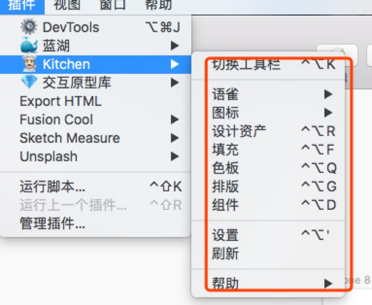
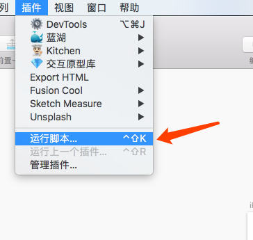
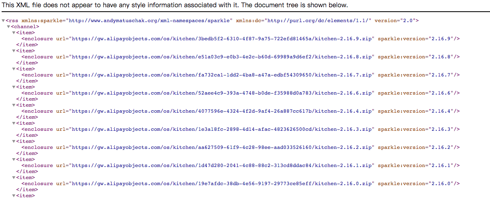
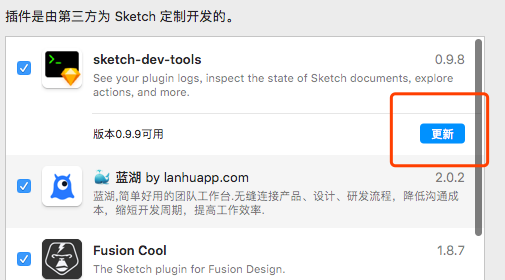

# Dev Sketch

今天这篇文章主要分享一下 sketch 插件开发的一些经验和心得。

在收到任务要开发 sketch 插件的时候就大量的去寻找资料。但是发现 github 上很多都是用 `OC` 和 `JS` 混合写的。但是因为我没多少时间去学习 `OC` 的写法，
并且在 `sketch` [官网](https://developer.sketch.com/)上也说了。`sketch` 升级的时候有可能内部的 `api` 会发生变化。但是暴露出去的 `js api` 基本是不会改变的。
所以最终决定全部采用 `js` 的写法。

## 目录

- sketch 开发中遇到的问题
  - 如何定义菜单
  - 如何触发 action
  - 如何构建 webview
  - webview 与 sketch 是如何通信的
  - 环境配置
  - 构建
  - 发布
- 如何解决这些问题

### 如何定义菜单

我们在使用 sketch 插件的时候经常会看到这些菜单。比如 antd 的 `kitchen` 插件。所有的插件都可以[在这里找到](https://github.com/sketchplugins/plugin-directory)



这是一个插件的工具栏。那么这个工具栏是在哪里定义的呢？在 sketch 中有一个叫做 `manifest.json` 的文件。在这个插件中可以定义这样的一系列菜单。看下 antd 的 `manifest.json` 的
定义。

```js
"commands": [
    {
      "script": "action.js",
      "handlers": {
        "actions": {
          "Startup": "onStartup",
          "Shutdown": "onShutdown",
          "ToggleInspectorVisibility.begin": "onToggleInterface",
          "OpenDocument": "onOpenDocument",
          "CloseDocument": "onCloseDocument",
          "SelectionChanged.finish": "onSelectionChanged",
          "TextChanged": "onTextChanged"
        }
      }
    },
    {
      "script": "index.js",
      "identifier": "showToolbar",
      "name": "切换工具栏",
      "shortcut": "ctrl alt k",
      "handler": "onShow"
    },
    {
      "script": "index.js",
      "identifier": "uploadArtboards",
      "name": "Artboard 上传",
      "shortcut": "ctrl alt a",
      "handler": "onUploadArtboards"
    },
    {
      "script": "index.js",
      "identifier": "syncSymbols",
      "name": "Symbol 同步",
      "shortcut": "ctrl alt w",
      "handler": "onSyncSymbols"
    },
    {
      "script": "index.js",
      "identifier": "resource",
      "name": "Iconfont",
      "shortcut": "ctrl alt i",
      "handler": "onResource"
    }
    ...other commands
]
```

这个代码中 `name` 属性代表的是菜单的名字。可以看出完全符合上述截图的部分。需要注意的是这个定义的每个 `action` 都是定义在 `commands` 这个对象下面。
`identifier` 是每个定义的菜单的标志。 `shortcut` 是短命令。可以用过快捷点来快速点击菜单。`handler` 为函数，就是点击这个菜单需要执行的函数。这个函数来自于
`script` 这个字段定义的文件中。比如此时 `script` 里是 `index.js`, 那么这个函数应该在这个文件中是可以查到的。[具体其他的查看官网](https://developer.sketch.com/plugins/)

### 如何触发 action

如果仔细看一下上述代码，你可能会注意到有这样一个代码

```js
{
  "script": "action.js",
  "handlers": {
    "actions": {
      "Startup": "onStartup",
      "Shutdown": "onShutdown",
      "ToggleInspectorVisibility.begin": "onToggleInterface",
      "OpenDocument": "onOpenDocument",
      "CloseDocument": "onCloseDocument",
      "SelectionChanged.finish": "onSelectionChanged",
      "TextChanged": "onTextChanged"
    }
  }
}
```

仔细看下这个定义了一个叫做 `handlers` 的对象。里面有一个叫做 `actions`, 这个 `actions` 的定义明显和上述菜单的定义不一样对吗？上面的菜单的定义是这样的

```js
{
  "script": "index.js",
  "identifier": "resource",
  "name": "Iconfont",
  "shortcut": "ctrl alt i",
  "handler": "onResource"
}
```

那么这里的 [actions](https://developer.sketch.com/plugins/actions) 是怎么来的呢？这些 `actions` 都是 `sketch` 内部暴露出来的。我们可以通过监听这个
`action` 来实现一些功能。比如 `OpenDocument` 在打开一个 sketch 文件的时候做一些初始化的操作。sketch 也内置了可以直接执行代码。



点击运行代码就可以直接运行一些脚本。所以如果需要用到 `sketch` 内部命令的时候, 就可以定义这些 `action`, 然后在对应的 `js` 文件中声明并且 export 出来。

```js
// onOpenDocument
export function onOpenDocument(context) {
  console.log('open document success')
}
```

### 如何构建 webwiew

因为在 github 上很多项目都是用 `OC` 来写的。所以这里我不会介绍如何使用 `OC` 来创建一个 `webview` 。这里的代码都是 `js` 写的。接下来介绍一个主要的用于创建 `webview` 的
包 [skpm-module-web-view](https://github.com/skpm/sketch-module-web-view) 。安装好这个包可以使用这个包初始化模板。比如创建一个 `webview` 的模板。这个使用了
with-webview 的模板

```js
skpm create my-plugin-name --template=skpm/with-webview
```

关于这个 webview 的文档主要需要关注的是两部分。

第一部分是 [brower-window](https://github.com/skpm/sketch-module-web-view/blob/master/docs/browser-window.md) 如何创建一个 webview,
并且如何加载一个页面。这个页面可以是来自于 server 也可以是来自于本地。

### webview 与 sketch 是如何通信的

第二部分是 webview 与 sketch [如何通信](https://github.com/skpm/sketch-module-web-view/blob/master/docs/communication-plugin-webview.md) 比如 webview 给 sketch
发送信息

```js
window.postMessage('nativeLog', 'Called from the webview')

// you can pass any argument that can be stringified
window.postMessage('nativeLog', {
  a: b
})

// you can also pass multiple arguments
window.postMessage('nativeLog', 1, 2, 3)

// `window.postMessage` returns a Promis with the array of results from plugin listeners
window.postMessage('nativeLog', 'blabla').then(res => {
  // res === ['result']
})
```

使用 `postMessage` 来发送消息到 `sketch` 中。在 sketch 中通过

```js
var sketch = require('sketch')

browserWindow.webContents.on('nativeLog', function (s) {
  sketch.UI.message(s)

  return 'result'
})
```

来接收 `web-view` 发送过来的消息。

sketch 给 webView 发送消息。首先在 webview 中定义方法。注意需要挂载到 `window` 上

```js
window.someGlobalFunctionDefinedInTheWebview = function (arg) {
  console.log(arg)
}
```

在 `sketch` 中调用 `executeJavaScript` 方法。

```js
browserWindow.webContents
  .executeJavaScript('someGlobalFunctionDefinedInTheWebview("hello")')
  .then(res => {
    // do something with the result
  })
```

这里需要注意的是传递给 function 中的值一定要是一个 string, 可以使用 `JSON.stringify()` 来转成 `string`

### 环境配置

有的时候是需要进行环境配置的。因为可能在测试环境需要加载测试环境的 `url`, 正式环境需要加载正式环境的 `url`。所以是需要区分的。那么应该如何去做呢？
在 Node 中通过大家会使用 `process.env` 这个。在 `sketch` 中如果使用了 `sketch-module-web-view`, 那么是可以自定义 webpack 环境的。所以想设置
不同的环境可以这样来做。首先需要建立一个名字叫 `webpack.skpm.config.js` 文件。里面的代码

```js
const webpack = require('webpack')

module.exports = () => {
  return {
    plugins: [
      new webpack.EnvironmentPlugin({
        NODE_ENV: 'development'
      })
    ]
  }
}
```

通过这样配置可以设置 `NODE_ENV` 默认为 `development`。这个大家也可以设置其他的。这个就是为了内部进行环境的区分的。然后可以配置相应的命令。在 `package.json` 中

```js
"start": "NODE_ENV=development skpm-build --watch --run",
"start:test": "NODE_ENV=test skpm-build --watch --run",
"start:pro": "NODE_ENV=production  yarn start",
```

可以通过不同的命令来运行不同的环境。到这里基本的操作应该都是可以完成的。

### 构建和发布

如果是在 github 上的话可以直接使用 `skpm` 内置的构建命令以及发布，其他的不同担心。

```js
"postinstall": "npm run build && skpm-link"
```

但是我这里主要讲的是在公司内部如何发布这个。首先可以查看[官网发布流程](https://developer.sketch.com/plugins/publish-a-plugin)。怕有些人会和一样一开始都是不怎么理解
这个发布。所以我详细讲解一下这个发布。首先看官网介绍需要一个 `appcast.xml` 的文件。这个文件可以选择放在服务器中。只要可以访问到就可以。其实可以看下 `kitchen` 的 `appcast.xml`

```js
"appcast": "https://kitchen.alipay.com/appcast.xml",
```

点击这个是完全可以访问的。那么在内部比如我们也生成这样一个 `xml` 文件。这个可以让服务端帮你生成。比如生成的地址是 `http://xxx.yyy.com/appcast.xml` 。然后在
`manifest.json` 文件中定义这样一个字段叫做 `appcast` 这个字段的 value 就是这个 url。那么这个里面应该放哪些内部呢？不妨以 `kitchen` 为例子。



可以看出每个 `item` 下面都有每个版本的具体包的地址，所以这是必要的。在 `appcast.xml` 中应该包含每个版本的信息，包括`版本号`以及相应的包的地址。当然也可以加上每个
版本的描述信息。当发布了一个新的版本后。在 sketch 中就会显示有新的版本需要更新。



### 结束语

上面就是在开发 `sketch` 插件中一个流程需要注意的一些基本操作。后面还是遇到很多问题的，那么详细的文档都可以参考[api 文档](https://developer.sketch.com/plugins/reference)
在这个文档中介绍了很多功能。如何去获取图层、选中的画板、创建画板等等。以及导出导入这些。当然目前 js 开放的 api 不是特别的多，但是很多小功能都是可以实现的。如果发现有不能实现的
可以提需求给 `sketch` 的。

最后就是介绍一个 sketch 讨论的网站。很多人会在[上面](https://sketchplugins.com/)讨论开发 `sketch` 遇到的问题
